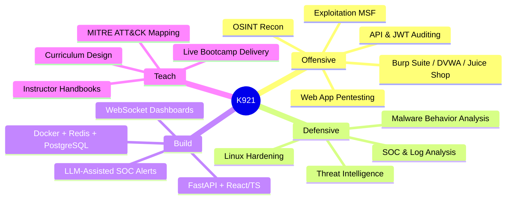
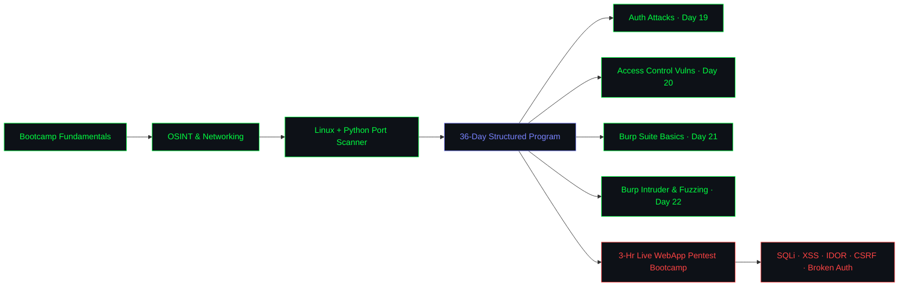

<!-- ═══════════════════════════════════════════════════════════ -->
<!--                  K921-CYBER | GITHUB README               -->
<!-- ═══════════════════════════════════════════════════════════ -->

<div align="center">

<!-- ░░░ ANIMATED HEADER BANNER ░░░ -->


<br/>

<!-- ░░░ ANIMATED TYPING SVG ░░░ -->


<br/><br/>

<!-- ░░░ SOCIAL BADGES ░░░ -->
<a href="https://www.linkedin.com/in/kabir-chand-2ab869250">
  
</a>
<a href="mailto:kabirchand31@gmail.com">
  
</a>
<a href="https://tryhackme.com/p/K4b1rX">
  
</a>
<a href="https://app.hackthebox.com/public/users/2459197">
  
</a>
<a href="https://github.com/K921-cyber">
  
</a>


</div>

---

<div align="center">

## `> INITIALIZING OPERATOR PROFILE...`

</div>

```
┌──────────────────────────────────────────────────────────────────────┐
│                                                                      │
│  ██╗  ██╗ █████╗ ██████╗ ██╗██████╗                                  │
│  ██║ ██╔╝██╔══██╗██╔══██╗██║██╔══██╗                                 │
│  █████╔╝ ███████║██████╔╝██║██████╔╝                                 │
│  ██╔═██╗ ██╔══██║██╔══██╗██║██╔══██╗                                 │
│  ██║  ██╗██║  ██║██████╔╝██║██║  ██╗                                 │
│  ╚═╝  ╚═╝╚═╝  ╚═╝╚═════╝ ╚═╝╚═╝  ╚═╝                                 │
│                                                                      │
│   ██████╗██╗  ██╗ █████╗ ███╗   ██╗██████╗                           │
│  ██╔════╝██║  ██║██╔══██╗████╗  ██║██╔══██╗                          │
│  ██║     ███████║███████║██╔██╗ ██║██║  ██║                          │
│  ██║     ██╔══██║██╔══██║██║╚██╗██║██║  ██║                          │
│  ╚██████╗██║  ██║██║  ██║██║ ╚████║██████╔╝                          │
│   ╚═════╝╚═╝  ╚═╝╚═╝  ╚═╝╚═╝  ╚═══╝╚═════╝                           │
│                                                                      │
│  OPERATOR  ──  Kabir Chand (K921-cyber)                              │
│  DEGREE    ──  B.Tech CSE (Cybersecurity Focus) — Final Year         │
│  ROLE      ──  Threat Intel Intern & Cyber Trainer @ HackHalt CIC    │
│  HONOR     ──  🏅 Medallion of Excellence — IndiaSkills Nationals    │
│                 25-26, Cyber Security (Skill 54)                    │
│  STATUS    ──  🟢 ONLINE — Building, Teaching & Bounty Hunting       │
│  MISSION   ──  Break Things Ethically. Build Things Defensively.     │
│                                                                      │
└──────────────────────────────────────────────────────────────────────┘
```

---

<div align="center">

## `> cat /etc/operator_profile`

</div>

<table>
<tr>
<td width="55%">

```python
#!/usr/bin/env python3
# operator_profile.py — K921

class K921(CyberOperator):

    name     = "Kabir Chand"
    alias    = "K921"
    location = "India 🇮🇳"
    degree   = "B.Tech CSE — Cybersecurity Focus, Final Year"

    roles = [
        "Threat Intelligence Intern @ HackHalt CIC",
        "Cybersecurity Trainer & Curriculum Designer",
        "Ex-Product Support Intern @ Threatcop (Kratikal)"
    ]

    skills = {
        "offensive": ["Web Pentesting", "OSINT", "Red Team",
                      "API/JWT Security", "Fuzzing"],
        "defensive": ["Threat Intel", "SOC Analysis",
                      "Linux Hardening", "Log Correlation"],
        "dev":       ["Python", "FastAPI", "React/TS",
                      "Docker", "PostgreSQL", "Redis"],
    }

    flagship_projects = ["A2DS", "TRINETRA", "PhishSentinel",
                          "INDRA"]

    certs_planned = ["eJPT", "OSCP", "CEH"]
    goals = ["Bug Bounty HoF", "Build tools people rely on",
             "Train the next generation of defenders"]

    philosophy = """
        'Security is not a product,
         it is a continuous state of paranoia.'
    """

    def status(self):
        return "🔴 Red Teaming  |  🔵 Teaching  |  🟢 Building"
```

</td>
<td width="45%">

### 🎯 Current Focus
```
[*] Threat Intelligence @ HackHalt CIC
[*] Designing 36-Day Cybersecurity Curriculum
[*] Delivering Live Pentest Bootcamps
[*] OSINT Platform Dev (TRINETRA / INDRA)
[*] AI-Powered Red/Blue Simulation (A2DS)
[*] Phishing Detection Tooling (PhishSentinel)
```

### ⚡ Quick Stats
```
🏅  National Honor      →  IndiaSkills Medallion
🔬  Flagship Projects   →  4 (A2DS · TRINETRA
                             · INDRA · PhishSentinel)
🎓  Learners Trained    →  Bootcamps + 36-Day Program
🌐  Platforms           →  THM | HTB | PicoCTF
📚  Certs In Progress   →  eJPT → OSCP path
☕  Fuel                →  Coffee + Curiosity
```

</td>
</tr>
</table>

---

<div align="center">

## `> mermaid --render skill_tree.mmd`

### 🧠 Operator Skill Tree

</div>



---

<div align="center">

## `> ls ~/certifications/ --verified`

🔐 All certs stored & verified → [**Cyber Cert Vault**](https://github.com/K921-cyber/CyberSecurity-Certifications)

<br/>

<a href="https://www.credly.com/earner/earned/badge/4eae526e-2aad-42ba-bc47-aef114dc4a50">
  
</a>
&nbsp;&nbsp;&nbsp;&nbsp;&nbsp;
<a href="https://www.credly.com/earner/earned/badge/15f86c9b-42c4-4fd8-b555-2fcc3de9c6fb">
  
</a>

<br/><br/>


&nbsp;

&nbsp;

&nbsp;

&nbsp;

&nbsp;


</div>

---

<div align="center">

## `> cat /proc/skill_matrix`

</div>

<table>
<tr>
<td width="50%" valign="top">

### 🔴 Offensive Arsenal

| Skill | Level |
|---|---|
| Web App Pentesting | `████████░░` 80% |
| OSINT & Recon | `█████████░` 85% |
| API / JWT Security Auditing | `████████░░` 80% |
| Network Recon & Enum | `████████░░` 80% |
| Exploitation (MSF) | `███████░░░` 70% |
| Privilege Escalation | `███████░░░` 70% |
| Active Directory Attacks | `████░░░░░░` 40% |

</td>
<td width="50%" valign="top">

### 🔵 Defensive Stack

| Skill | Level |
|---|---|
| Threat Intelligence | `████████░░` 80% |
| SOC & Log Analysis | `███████░░░` 70% |
| Linux Hardening | `████████░░` 80% |
| Malware Analysis | `██████░░░░` 60% |
| Incident Response | `██████░░░░` 60% |
| Network Forensics | `███████░░░` 70% |
| Curriculum & Training Design | `█████████░` 90% |

</td>
</tr>
</table>

---

<div align="center">

## `> dpkg --list | grep installed`

### 🔴 Offensive Tools


### 🔵 Defensive & Intel Tools


### 💻 Dev & Build Stack


</div>

---

<div align="center">

## `> ps aux | grep flagship_projects`

</div>

<table>
<tr>
<td>

### 🛰️ TRINETRA — India-Focused OSINT Platform
```
STATUS: [████████░░] ACTIVE | PRIORITY: HIGH
─────────────────────────────────────────────
◈ 19 modular OSINT plugins
◈ FastAPI + React/TypeScript frontend
◈ PostgreSQL + Redis + Docker deployment
◈ Enterprise-grade technical proposal shipped
─────────────────────────────────────────────
[*] Actively expanding plugin library
```

</td>
<td>

### 🤖 A2DS — AI Attack & Defense Simulator
```
STATUS: [████████░░] ACTIVE | PRIORITY: HIGH
─────────────────────────────────────────────
◈ Hybrid Red Team / Blue Team platform
◈ FastAPI backend + Redis detection worker
◈ Live WebSocket SOC dashboard
◈ Claude-powered AI alert explanations
◈ 39-test pytest suite passing
─────────────────────────────────────────────
[*] Simulating attacks & training defenders
```

</td>
</tr>
<tr>
<td>

### 🎣 PhishSentinel v2.0.2 — Phishing Defense Ext.
```
STATUS: [█████████░] STABLE | PRIORITY: HIGH
─────────────────────────────────────────────
◈ Chrome Extension, Manifest V3
◈ FastAPI backend, 4 concurrent detect engines
◈ ML + domain forensics + heuristics + auth
◈ CORS & message-channel hardened
─────────────────────────────────────────────
[*] Multi-engine detection, production-ready
```

</td>
<td>

### 🧭 INDRA — Centralized OSINT Platform
```
STATUS: [██████░░░░] BUILDING | PRIORITY: MED
─────────────────────────────────────────────
◈ India-relevant OSINT data sources
◈ FastAPI + SQLite backend
◈ Companion to TRINETRA's plugin model
─────────────────────────────────────────────
[*] Consolidating source coverage
```

</td>
</tr>
</table>

---

<div align="center">

## `> cat ~/teaching/curriculum_stats.log`

### 🎓 HackHalt Cyber Intelligence Council — Training Ops

</div>



> Each module ships as a **60-min instructor package**: hands-on labs, MITRE ATT&CK mapping, OWASP Top 10 2025 references, and SOC/VAPT/Bug Bounty career framing.

---

<div align="center">

## `> cat ~/roadmap/2026.md`

</div>

<table>
<tr>
<td width="50%">

### ⚔️ Offensive Path
```
✅  Web App Pentesting Fundamentals
✅  OSINT & Reconnaissance Mastery
✅  API & JWT Security Auditing
✅  Live Bootcamp Delivery (SQLi/XSS/IDOR/CSRF)
🔄  Advanced Web Exploitation
🔄  eJPT Certification
⬜  Active Directory Attacks
⬜  OSCP Certification
⬜  Bug Bounty (HackerOne / BBP)
```

</td>
<td width="50%">

### 🛡️ Defensive & Teaching Path
```
✅  SOC Analyst Fundamentals
✅  Linux Hardening & Privilege Esc. Audits
✅  36-Day Curriculum Architecture
🔄  Threat Intelligence Ops @ HackHalt
🔄  Malware Behavioral Analysis
⬜  DFIR & Digital Forensics
⬜  CySA+ Certification
⬜  Scale Training to 100+ Learners
```

</td>
</tr>
</table>

> `✅ Done   🔄 In Progress   ⬜ Planned`

---

<div align="center">

## `> cat /var/log/github_stats`

<br/>


<br/>


<br/><br/>

<!-- GitHub Trophies -->

<br/>

<!-- Activity Graph -->


</div>

---

<div align="center">

## `> ./feed_the_snake.sh`


</div>

---

<div align="center">

## `> nc -lvnp 4444`

<br/>

| 🔗 Channel | 📍 Handle | 🟢 Status |
|:---:|:---:|:---:|
| 📧 **Email** | [kabirchand31@gmail.com](mailto:kabirchand31@gmail.com) | 🟢 Active |
| 💼 **LinkedIn** | [Kabir Chand](https://www.linkedin.com/in/kabir-chand-2ab869250) | 🟢 Active |
| 🎯 **TryHackMe** | [K4b1rX](https://tryhackme.com/p/K4b1rX) | 🟢 Hunting |
| 🖥️ **HackTheBox** | [K4b1rX](https://app.hackthebox.com/public/users/2459197) | 🔄 Active |
| 🏢 **HackHalt CIC** | Threat Intel & Trainer | 🟢 Active |
| 🌐 **Portfolio** | Signal Lost — Rebuilding... | 🟡 Soon |

<br/>

```bash
$ echo $HACKER_MINDSET
> "An attacker only needs to be right once."
> "A defender needs to be right every time."
> "Know your enemy. Know yourself. Know the network."
> "Persistence > Perfection. Methodology > Luck."
> "Teach what you break. Break what you're taught."

$ echo "Always be learning..." >> ~/.bashrc && source ~/.bashrc
[✓] Loaded. Hacking on...
```

<br/>


<sub>⚡ Built with <code>paranoia</code>, <code>caffeine</code>, and too many <code>nmap</code> scans ⚡</sub>

</div>
